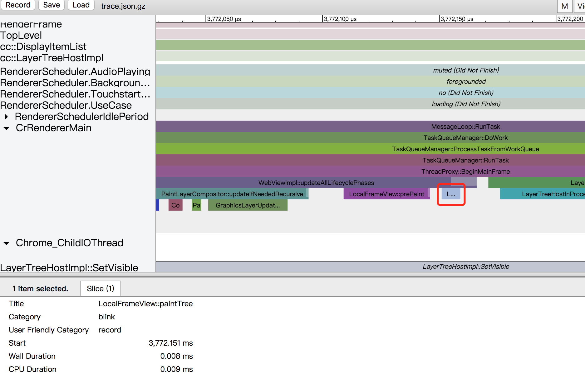

# PaintReduce
研究compositing和paint的时候发现有些概念特别容易混在一起，所以重新研究了下减少paint的情况

## 问题 
* [`demo1`](https://codepen.io/yoution/pen/aqPLeB)

蓝色方块和绿色方块各自的paintLayer由于`will-change`的存在，生成各自对应的graphicsLayer   
#### 绿色方块触发hover后:

可以发现没有进行paint过程    

* [`demo2`](https://codepen.io/yoution/pen/EQGoyp)

蓝色方块生成graphicsLayer，绿色方块由于overlap原因，产生graphicsLayer，但是这两个graphicsLayer是不同类型的layer，layer图上可以看到绿色方块对应的graphicsLayer的标示为`.composited.box.blue`，而不是`.box.green`，这其实是squash生成的graphicsLayer并不是对应绿色方块，而是对应蓝色方块的squashLayer，是属于蓝色方块的。
#### 绿色方块触发hover后:
1. 蓝色方块

2. 绿色方块

可以看到两个方块都触发了paint，对比demo1，蓝色方块由于是单独的graphicsLayer，应该不触发paint的，但是实际却触发了paint，绿色方块由于没有`will-change`，所以触发了paint。   
但是从图上可以看到，这两个paint过程又是不一样的，蓝色方块没有像绿色方块一样进行实际的paint过程，对于绿色方块则进行了paint操作，原因是绿色方块没有`will-change`，所以触发paint，但是由于绿色方块是蓝色方块的squashLayer，squashLayer发生变化，会导致蓝色方块发生paint，由于有缓存，蓝色方块对应的paintLayer由于没有发生变化，直接取了缓存，所以只是进行的paint函数，没有进行paint操作

## 减少paint
这篇[`文章`](https://developers.google.com/web/fundamentals/performance/rendering/simplify-paint-complexity-and-reduce-paint-areas)有介绍减少paint，讲到了`will-change`，发现还有其他参数可以代替`will-change`，实现相同的效果

### 触发参数
* kCompositingReason3DTransform，如transform:perspective(400px),transform: translateZ(10)，transform:scaleZ(0.5)等 [`demo`](https://codepen.io/yoution/pen/GQPQex)
* kCompositingReasonActiveAnimation, 包括opacityAnimation, transformAnimation，filterAnimation，backDropFilterAnimation [`demo`](https://codepen.io/yoution/pen/ZrVoLv)
* kCompositingReasonWillChangeCompositingHint,包括opacity, top, left, bottom, right，transform [`demo`](https://codepen.io/yoution/pen/MQZGZB)
* kCompositingReasonBackfaceVisibilityHidden [`demo`](https://codepen.io/yoution/pen/paqamM)

## tracing图

对比timeline，图上可以看到，虽然在timeline上没有显示paint过程，其实浏览器实际还是走了paint函数，只是当前paintLayer不需要paint，所以直接返回了
